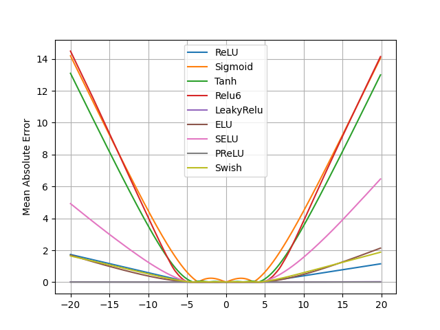

# NALU2IM
Neural Arithmetic Logic Units with Two Transition Matrix and Independent Gates

An implementation of Neural Arithmetic Logic Units (https://arxiv.org/pdf/1808.00508.pdf)

## Exp 1: Fail to Extrapolate
Train an identity mapping on [-5, 5] and test it on [-20, 20]

```bash
python3 failure.py
```

#### Results

* Most non linear activation functions fail to exprapolate except that PReLU can learn to be highly linear.



## Exp 2: Static Simple Function Learning
Input a 100-dimensional vertex **x**, learn `y = func(a, b)`,
where 
,   and `func = +, -, x, /, ...`. Test the ability to interpolate and extrapolate.

```bash
python3 learn_function.py
```
### Interpolation
* RMSE (normalized to a random baseline)

|     |ReLU|Sigmoid|NAC|NALU|NALU2M|NALUIG|NALU2MIG|
| --- |  --- | --- | --- | --- | --- | --- | --- |
|a + b|0.00|0.12|0.00|0.33|0.10|0.00|0.02|
|a - b|0.27|0.37|0.00|9.88|0.00|90.44|0.13|
|a x b|1.84|1.20|13.71|0.91|0.36|6.87|0.00|
|a / b|0.67|0.14|1.75|0.21|0.06|0.05|0.01|
|a ^ 2|4.02|0.43|21.79|1.31|0.17|7.42|0.00|
|sqrt(a)|0.80|0.07|2.95|0.05|0.04|0.01|0.01|

### Extrapolation
* RMSE (normalized to a random baseline)

|     |ReLU|Sigmoid|NAC|NALU|NALU2M|NALUIG|NALU2MIG|
| --- |  --- | --- | --- | --- | --- | --- | --- |
|a + b|0.00|62.47|0.00|85.86|44.93|0.02|0.44|
|a - b|55.18|55.74|0.00|80.15|0.00|90.54|0.39|
|a x b|57.51|88.54|76.09|99.89|98.28|85.50|0.00|
|a / b|2.73|1.15|20.77|3.35|1.03|16.82|0.11|
|a ^ 2|58.25|82.84|77.55|98.61|76.69|88.29|0.00|
|sqrt(a)|18.32|19.57|65.64|45.42|21.23|4.60|0.19|


## Abstract

Neural Networks always have been used
to manipulate numerical information based on the
training, however, their learning behavior does not
display systematic generalization. Due to its inability
to successfully perform operations when the numerical
range used during the test time lie outside during
training. To address the systematic generalization,
we propose an existed architecture called Neural
Arithmetic Logic Units (NALU) but with addition
of Independent Gates to it. We would like to call
this architecture as Neural Arithmetic Logic Units
with Independent Gates (NALUIG) that can represents numerical quantities as linear activations using:
primitive arithmetic, operators, controlled by learned
gates which will be independent of the input; use of
separate weight matrices for the adder and multiplier.
Along with that, we have also introduced two more
architectures called, Neural Arithmetic Logic Unit
with two Transition Matrix (NALU2M), and Neural
Arithmetic Logic Unit with two Transition Matrix
and Independent Gates (NALU2MIG), by changing
the specifications of the original architecture, NALU.
Based on our strategy to represent numerical quantities as individual neurons without a non-linearity
using independent gates, our experiments show that
NALUIG, NALU2M, and NALU2MIG enhanced neural networks can learn to perform arithmetic over
images of numbers, and execute computer code with
very lower error rates than other existing neural
networks. In this paper, we obtain better results in
terms of numerical range generalization then the state
of art

See [nalu.py](nalu.py) for more details. I found these modifications can help the performance on the static simple function learning task.

